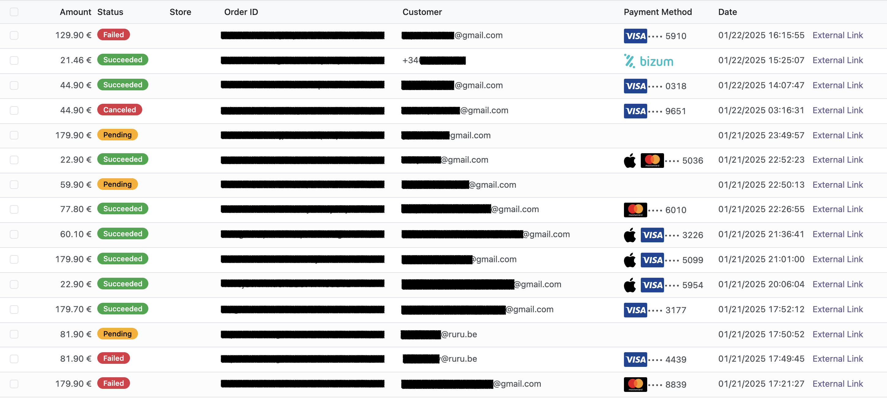
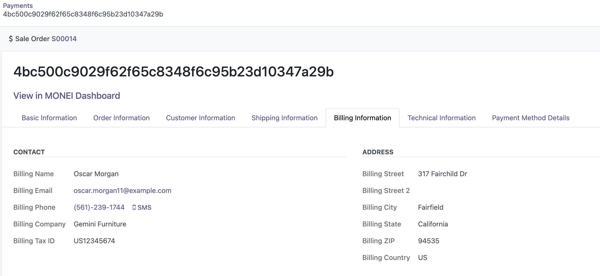

# MONEI Payment Integration for Odoo

This module integrates MONEI payment services with Odoo, providing a seamless way to track and manage your MONEI payments directly within Odoo.

## Features

- **Payment Synchronization**: 
  - Manual sync of payments from MONEI to Odoo
  - Sync payments by date range
  - Import historical payments
- **Order Integration**: 
  - Automatic linking with Odoo sale orders using order references
  - View linked payments directly from sale orders
- **Payment Management**: 
  - View payment status and details
  - Process refunds
  - Capture authorized payments
  - Cancel pending payments
- **Dashboard Access**: Direct links to MONEI Dashboard for each payment

## Installation

### Odoo.sh Platform
1. Go to your project on [Odoo.sh](https://odoo.sh)
2. Navigate to the "Repositories" tab
3. Click "Add a Repository" and select "Add a Git Repository"
4. Enter the repository URL: `https://github.com/MONEI/MONEI-Odoo`
5. Select the branch you want to deploy
6. Go to the "Branches" tab and activate the branch where you want MONEI installed
7. Wait for the deployment to complete (you can check status in "Builds")
8. Once deployed, go to Apps and search for "MONEI"
9. Click Install on the MONEI module

Note: If you don't see the module in Apps after deployment:
- Enable developer mode (Settings → General Settings → Developer Tools → Activate the developer mode)
- Go to Apps → Update Apps List (menu in the top bar)
- Search for "MONEI" again

### Self-Hosted Odoo
1. Download the module
2. Place the `monei` folder in your Odoo addons directory:
   - Linux: `/opt/odoo/addons/` or `/usr/lib/python3/dist-packages/odoo/addons/`
   - Windows: `C:\Program Files\Odoo\server\odoo\addons\`
3. Restart your Odoo server
4. Update the apps list in Odoo:
   - Enable developer mode
   - Go to Apps > Update Apps List
5. Search for "MONEI" and install the module


## Configuration

### Prerequisites

Before installing:
- Make sure you have a MONEI account
- Have your API key ready (test or production)
- Ensure you have admin rights in your Odoo instance

### Before you start

Use your test mode API Key. You can find them in [MONEI Dashboard → Settings → API Access](https://dashboard.monei.com/settings/api).

You can check the status of a test payment in your [MONEI Dashboard → Payments](https://dashboard.monei.com/payments) (in test mode).

### Configure MONEI API Key

1. Go to MONEI > Configuration or Settings > MONEI in Odoo
2. Enter your MONEI API Key
   
4. Save the configuration

The module will automatically sync your payments.

### Before you go live

Make sure that you are using [live (production) mode](https://docs.monei.com/docs/testing/) API Key.

Make sure that you have at least one active [payment method](https://dashboard.monei.com/settings/payment-methods).

## Payment Synchronization

### How Syncing Works

1. **Initial Sync**
   - After configuring your API key, use the Sync button to import payments
   - Select a date range to import payments from that period
   - The module will import all MONEI payments within the selected dates

2. **Manual Syncing Process**
   - Go to MONEI > Payments
   - Click the "Sync Payments" button
   - Select start and end dates for the sync
   - The module will:
     - Import new payments from the selected period
     - Update existing payment information
     - Show a summary of changes when complete

3. **Automatic Syncing**
   - The module will automatically sync payments based on the configured interval
   - The sync interval is set in the MONEI > Configuration or Settings > MONEI configuration screen

4. **Order Matching**
   - Payments are automatically linked to sale orders using the order reference
   - Each payment's order reference is matched to a sale order number
   - View linked payments directly from the sale order form

## Usage

### View Payments



Navigate to MONEI > Payments to see all your MONEI payments in one place.
- Filter by status, date, amount, etc.
- View detailed payment information

- Access payment actions

### Payment Actions
Each payment supports various actions depending on its status:
- **Create**: Create a new payment
  
- **Refund**: Process full or partial refunds
  
- **Capture**: Capture authorized payments
  
- **Cancel**: Cancel pending payments
  
- **Send payment link**: Send payment link to the customer
  
- **View Order**: Direct access to linked sale order

### Order Linking
The module automatically links payments with sale orders based on the order reference.
You can also:
- View payment information in sale orders
  
- Access MONEI Dashboard directly from orders
  

## Troubleshooting

Common issues and solutions:

- **Module not visible after installation**: Update the apps list in developer mode
- **Orders not linking**: Ensure order references match between MONEI and Odoo

## Support

For support:

- Check the [MONEI Documentation](https://docs.monei.com/)
- Contact [MONEI Support](https://support.monei.com)
- Create an issue in this repository

## License

This module is licensed under LGPL-3.

## Credits

Developed by [MONEI](https://monei.com/)

## Contributing

To contribute:

1. Fork the repository
2. Create a new branch from the version branch you want to contribute to (16.0, 17.0, or 18.0)
3. Make your changes
4. Follow the commit message convention:
   - `feat: new feature` for features
   - `fix: bug description` for bug fixes
   - `docs: description` for documentation changes
   - `chore: description` for maintenance tasks
4. Push your changes and create a pull request

### Releasing

Releases are automated based on pull request commits. When a pull request is merged to version branches (16.0, 17.0, 18.0):

1. The version will automatically bump based on your commits:
   - `feat:` commits trigger a minor version bump (1.1.0)
   - `fix:` commits trigger a patch version bump (1.0.1)
   - Add `BREAKING CHANGE:` in commit body for major version bump (2.0.0)

2. The GitHub Action will:
   - Update version in `__manifest__.py`
   - Create a new tag
   - Generate release notes from commits
   - Create a GitHub release

For example:
```bash
# This will trigger a patch release (e.g., 1.0.1)
git commit -m "fix: payment sync timeout issue"

# This will trigger a minor release (e.g., 1.1.0)
git commit -m "feat: add payment method filtering"

# This will trigger a major release (e.g., 2.0.0)
git commit -m "feat: switch to new API

BREAKING CHANGE: This version is not compatible with previous versions"

# When the PR is merged, the version will be bumped automatically
```

The version bump is determined by analyzing all commits in the PR:
- If any commit contains `BREAKING CHANGE`, it's a major bump
- Otherwise, if any commit starts with `feat:`, it's a minor bump
- Otherwise, it's a patch bump